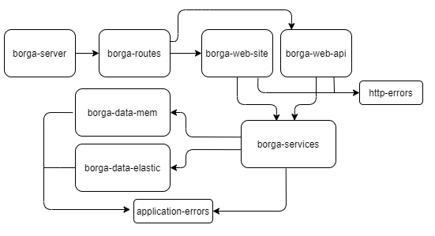
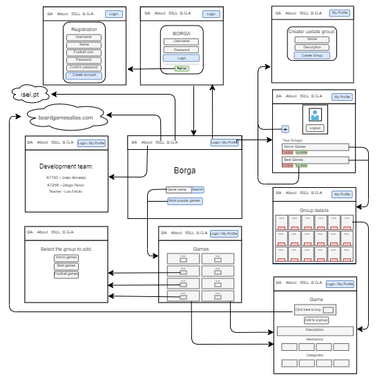

## **Descrição da estrutura da aplicação**

#### **Servidor**
A estrutura do lado do servidor desta aplicação está retratada abaixo, na qual se pode observar que o primeiro módulo, isto é, `borga-server`, é utilizado para dar início à mesma, ou seja, corresponde ao entry point.



##### **Responsabilidades de cada módulo:**
- `borga-routes`: interliga os módulos e declara *middlewares* para certas rotas
- `borga-web-api`: implementa as rotas HTTP correspondentes à REST API da aplicação
- `borga-web-site`: implementa as rotas HTTP utilizadas para o web site da aplicação
- `users-web-site`: implementa as rotas HTTP referentes ao início ou fim de sessão de um utilizador
- `borga-services`: implementa a lógica de cada funcionalidade disponibilizada
- `board-games-data`: implementa o acesso à Board Game Atlas API
- `borga-data-mem`: implementa o acesso aos dados guardados em memória, mais especificamente, no ficheiro borga-database
- `borga-data-elastic`: implementa o acesso aos dados guardados na base de dados da ElasticSearch
- `application-errors`: contém todos os erros correspondentes à lógica da aplicação, os quais são constituído por um código e uma mensagem
- `http-errors`: implementa a transformação dos erros aplicacionais para erros HTTP

#### **Cliente**

Já em relação ao lado do cliente, este através de um *browser*, ao solicitar alguma operação sobre o mesmo, irá estar a realizar um pedido HTTP ao servidor, o qual ao recebê-lo e processá-lo irá efetuar uma resposta HTTP para o cliente com os resultados obtidos do pedido realizado. Embora a maioria dos pedidos seja processada através do módulo `web-site`, pedidos relacionados com edição e remoção, serão processados pelo módulo web-api, uma vez que os pedidos PUT e DELETE através de um browser só conseguem ser realizados a partir de código *javascript* a correr no cliente.

##### **Estrutura da navegação no site**



## **Estrutura do armazenamento dos dados**

#### **Em memória**
Foram criados **quatro** objetos, com o objetivo de todas as operações que envolvessem ler e/ou escrever dados pudessem ser feitos com complexidade temporal **O(1)**, de forma a que o tempo para realizar alguma operação sobre os mesmos fosse o menos possível.

```
const user = {
  token: {
    username: "...",
    name: "...",
    club: "..."
  }
}

const credentials = {
  username: {
    password: "...",
    token: "..."
  }
}

const games = {
  gameId: {
    id: "...",
    name: "...",
    url: "...",
    image_url: "...",
    mechanics: [],
    categories: []
  }
}

const groups = {
  token: {
    Map(
        groupId,
        { 
          name: "...",
          description: "...",
          games: Set(gameId)
        }
    )
  }
}
```
#### **Em ElasticSearch**
Foram criados **quatro** documentos, com o mesmo objetivo, isto é, obter os dados no menor tempo possível, cada um
contendo as propriedades descritas a seguir ao URI.
```
credentials/_doc/{username} -> password, token
users/_doc/{token} -> username, name, club
games/_doc/{gameId} -> id, name, url, image_url, mechanics[], categories[]
groups-{token}/_doc/{groupId} -> name, description, games[gameId]
```

## **Mapeamento entre os documentos em ElasticSearch e os objetos da aplicação web**

De forma a que não existissem muitas diferenças entre ambos, os dados inseridos nos documentos da ElasticSearch são praticamente todos os dados dos objetos necessários para a aplicação web. Quando é preciso mais alguma propriedade que está presente noutro documento ou até filtrar, no módulo que faz a ligação à base de dados este processo é realizado para cada funcionalidade.

## **Documentação da API do servidor**

A documentação da API pode ser consultada no site: [API Docs](inserir site do heroku)

## **Instruções para correr a aplicação**

Antes de realizar qualquer operação é necessário **instalar os módulos dos quais a aplicação depende**, para tal, ao estar na raíz do projeto, basta executar o comando: `npm install`
#### **Testes**
Os testes foram realizados através de dados previamente inseridos no ficheiro `borga-database-tests`, os quais são para uso exclusivo nos testes. Portanto, caso se queira realizar mais testes e adicionar mais dados para testar, é neste ficheiro que deve ser feito, ou noutro, desde que seja seguida a mesma estrutura dos dados.
Neste projeto foram realizados testes para o módulo `services` e para o módulo `web-api`, necessitando, este último, de ligação à internet.
Para correr ambos os testes basta inserir na linha de comandos, na raíz do projeto, o comando: `npm test`
**Atenção** que para os testes relativos à **web-api** passarem com sucesso é necessário inserir uma **variável de ambiente** com a chave `ATLAS_CLIENT_ID`, na qual o seu valor deve corresponder ao `client_id` atribuído pela Board Game Atlas. Se ainda não tem ou não se lembra, consulte em [Board Game Atlas](https://www.boardgameatlas.com/api/docs/apps).

#### **Correr a aplicação**
Após ter instalado os módulos necessários e ter colocado o seu `client_id` relativo à Board Games Atlas na variável de ambiente descrita em cima, está pronto para executar a aplicação. Para tal basta inserir na linha de comandos, na raíz do projeto, o comando: `npm start`. Agora, ao aceder ao site http://localhost:1904/ (por default, caso tenha alterado será esse que deve colocar), já poderá navegar pelas funcionalidades do mesmo.

Caso pretenda visualizar o site sem ser na sua máquina, o mesmo pode ser consultado através do link [BORGA App](link do heroku), uma vez que foi *deployed* para *host* Heroku.
